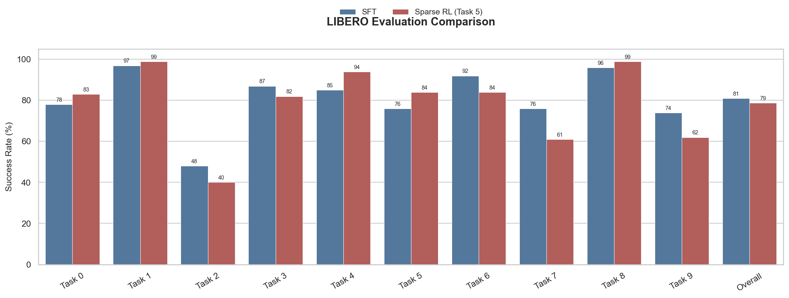
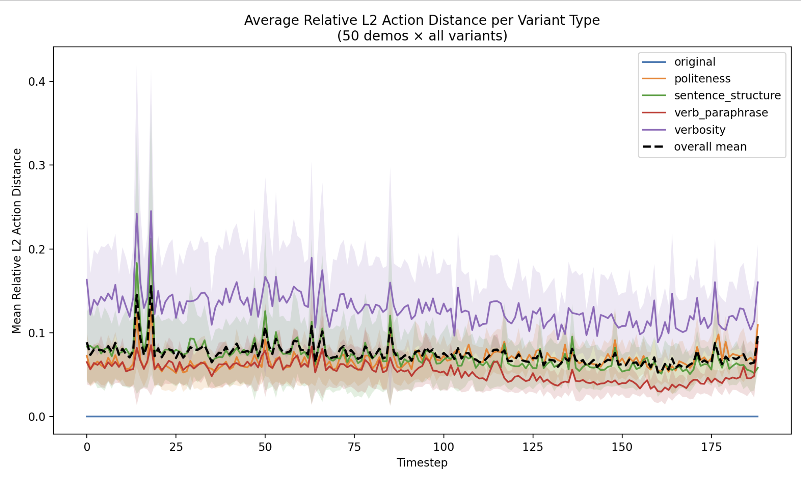

# VLA Robotics

## Setup

```bash
git clone https://github.com/runeharlyk/vla-robotics
cd vla-robotics
uv sync
```

## Results

Latest results are tracking in:
- `results/` for raw training and eval results
- [docs/smolvla_libero_eval.md](docs/smolvla_libero_eval.md) for SmolVLA LIBERO results
- [docs/fpo_hyperparameter_experiments.md](docs/fpo_hyperparameter_experiments.md) for FPO hyperparameter experiments

Current SmolVLA LIBERO results:

| Suite | Success (SFT) | Success (RL) | Episodes |
| ----- | ------------- | ------------ | -------- |
| `libero_spatial` | `80.9%` | `78.8%` | `1000` |
| `libero_object` | `86.3%` | - | `1000` |



<!-- Regenerate plots from committed eval results:

```bash
uv run python -m vla.utils.plot_results --results-dir results/evals --suite spatial
``` -->

## Studies

### Perturbation study

We did a study to explore and understand how the model performs under different perturbations.

The models action sensitivity to language instructions and visual changes is shown below:




This is quantified by looking the models succesrate and mean episode length under different perturbations.

### Attention study

- Visual study: `src/vla/diagnostics/` contains cross-attention, self-attention, and Grad-CAM analysis.

### Reward study

Explores [SRPO](https://arxiv.org/abs/2511.15605) as a way to improve training signal.

Goal:

- Quantify Progress Monotonicity
- Quantify the difficulty of differentiating between demonstrations, successful and failed trajectories, and random trajectories.
- Test encoding methods: per-frame mean pool, clip-based and [siiRL](https://github.com/sii-research/siiRL/blob/main/siirl/utils/embodied/video_emb.py) implementation.