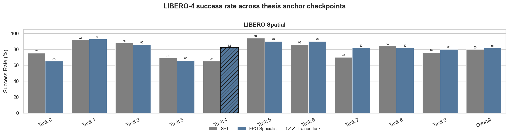
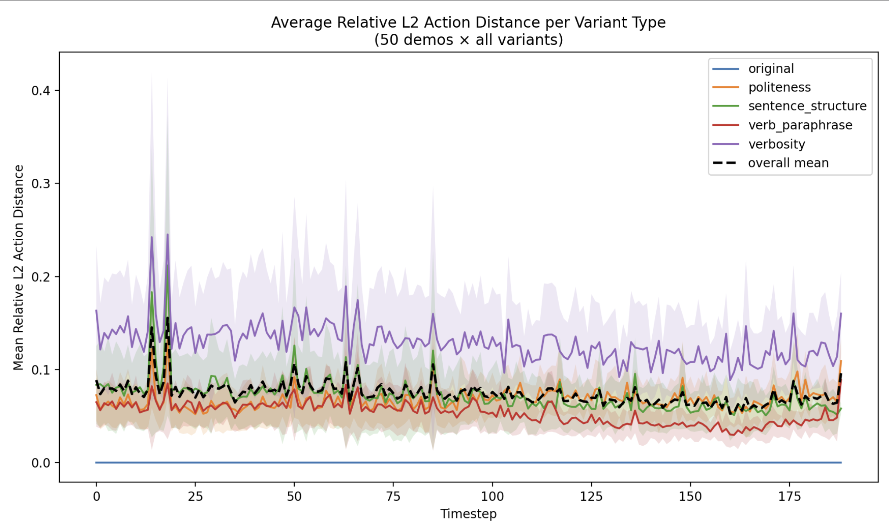

# VLA Robotics

## Setup

This project targets `Python 3.11.14`.

```bash
git clone https://github.com/runeharlyk/vla-robotics
cd vla-robotics
uv sync
uv sync --dev
```

### Windows LIBERO

Native Windows LIBERO installs need two extra pieces beyond a normal `uv sync`:

```powershell
uv run python scripts/setup_libero.py --install
uv run python -m vla visualize --checkpoint HuggingFaceVLA/smolvla_libero --simulator libero --suite spatial
```

`scripts/setup_libero.py --install` downloads the upstream `libero` source distribution, installs the package into the active virtualenv, and fetches the missing LIBERO assets that upstream expects at runtime. It also creates the non-interactive LIBERO config file that upstream otherwise prompts for on first import.

On Windows the setup script now:

- installs the `libero` package directly into the active `.venv`
- downloads the missing LIBERO scene assets into that installed package
- writes the LIBERO config under `.libero\config.yaml` in the repo by default
- uses `.hf-cache\` in the repo for Hugging Face downloads unless `HF_HOME` is already set
- patches `robosuite` for Windows so `MUJOCO_GL=wgl` works without the Linux EGL path

If you want datasets/config outside the repo-local defaults:

```powershell
uv run python scripts/setup_libero.py --install --config-dir C:\libero-config --datasets-dir D:\libero-data
```

## Results

Latest results are tracking in:
- `results/` for raw training and eval results
- [docs/fpo_hyperparameter_experiments.md](docs/fpo_hyperparameter_experiments.md) for FPO hyperparameter experiments


### Protocol impact

| Evaluation setting | Simulator stack | Episodes per task | LIBERO Spatial |
| ------------------ | --------------- | ----------------- | -------------- |
| SmolVLA paper | Published setup | `10` | `89.9%` |
| Thesis static init | Initial setup | `100` | `80.9%` |
| Thesis random init | Before MuJoCo pin | `100` | `74.3%` |
| Thesis random init | `MuJoCo==3.3.2` | `100` | `80.4%` |

Calibrated SFT baseline under the pinned thesis protocol:

| Suite | SmolVLA paper | Calibrated SFT |
| ----- | ------------- | -------------- |
| `libero_spatial` | `90.0%` | `80.4%` |
| `libero_object` | `96.0%` | `90.4%` |
| `libero_goal` | `92.0%` | `79.3%` |
| `libero_long` | `71.0%` | `44.3%` |

### RL post-training

Sparse RL was applied to LIBERO Spatial. The strongest multi-task result is
effectively tied with the calibrated SFT baseline, while the largest numerical
gain comes from a task-4 specialist and does not hold as a robust multi-seed
suite-level improvement.

| Study | Checkpoint | LIBERO Spatial | vs. calibrated SFT |
| ----- | ---------- | -------------- | ------------------ |
| Calibrated SFT baseline | Public checkpoint | `80.4%` | - |
| Best multi-task RL (Flow-GRPO) | Promoted | `80.5%` | `+0.1 pp` |
| Best single-task RL (FPO, task 4) | Promoted | `81.6%` | `+1.2 pp` |
| Single-task RL (FPO, task 4, 4-seed mean) | Promoted | `79.9%` | `-0.5 pp` |
| Best Success-BC (RLPD-style) | Promoted | `73.6%` | `-6.8 pp` |

Task-4 specialist per-task success rates across four seeds:

| Model | T0 | T1 | T2 | T3 | T4 | T5 | T6 | T7 | T8 | T9 | Mean |
| ----- | -- | -- | -- | -- | -- | -- | -- | -- | -- | -- | ---- |
| SFT | `74` | `93` | `90` | `70` | `68` | `86` | `87` | `76` | `80` | `80` | `80.4` |
| seed 42 | `65` | `93` | `86` | `66` | `82` | `90` | `90` | `82` | `82` | `80` | `81.6` |
| seed 123 | `70` | `91` | `92` | `66` | `77` | `88` | `82` | `77` | `83` | `76` | `80.2` |
| seed 456 | `68` | `92` | `78` | `65` | `83` | `93` | `78` | `81` | `79` | `74` | `79.1` |
| seed 789 | `67` | `86` | `83` | `64` | `84` | `88` | `79` | `73` | `87` | `77` | `78.8` |
| mean | `67.5` | `90.5` | `84.8` | `65.3` | `81.5` | `89.8` | `82.3` | `78.3` | `82.8` | `76.8` | `79.9` |

Policy-update family comparison:

| Update family | Evidence | Spatial | Notes |
| ------------- | -------- | ------- | ----- |
| SFT baseline | Public checkpoint | `80.4%` | Denominator |
| FPO (all 10 tasks) | Explicit promotion | `80.3%` | 8 trajectories/task; below SFT |
| FPO (5 weak tasks) | Explicit promotion | `80.5%` | Trained only on tasks 0, 3, 4, 7, 9 |
| Flow-GRPO (multi-task) | Best promotion | `80.5%` | Task 5 near `91%`; others near SFT |
| Flow-GRPO (multi-task) | Second explicit promotion | `79.2%` | Same protocol |
| Success-BC / RLPD | Best explicit promotion | `73.6%` | Same protocol |

Action chunking is sensitive under the thesis protocol. The public checkpoint
drops from `80.4%` at `n_action_steps=1` to `76.5%` at `2`, `71.2%` at `5`,
`67.7%` at `10`, and `50.4%` at `50`.



<!-- Regenerate plots from committed eval results:

```bash
uv run python -m vla.utils.plot_results --results-dir results/evals --suite spatial
``` -->

## Experiments And HPC Jobs

Training and eval runs are defined as Hydra configs, while `jobs/` only contains shared LSF environment/profile helpers and a few legacy SFT/eval wrappers.

- Train configs: `configs/train_srpo/experiment/`
- Eval configs: `configs/evaluate/experiment/`
- Queue profiles: `jobs/_profiles.yaml`
- Generated submit scripts: `jobs/generated/` (gitignored)

List and inspect configured experiments:

```bash
uv run invoke list-experiments --kind train
uv run invoke list-experiments --kind eval
uv run invoke list-training-runs --experiment fpo_t5_v28_control
uv run invoke list-unrun-experiments
```

Create a validated LSF submit script:

```bash
# Train from a training experiment config.
uv run invoke submit-train --experiment fpo_t5_v28_control --profile l40s-16

# Evaluate the base SFT checkpoint from an eval experiment config.
uv run invoke submit-eval --experiment spatial_sft_seeded --profile a10-10h

# Evaluate a checkpoint produced by a training experiment.
uv run invoke submit-eval --experiment fpo_t5_v28_control --checkpoint best --profile a10-10h
```

`submit-train` always reads from `configs/train_srpo/experiment/`. `submit-eval` first checks whether `--experiment` names a training experiment; if it does, it finds the matching local training record, resolves `--checkpoint best`, `last`, or `best-rollout`, and checks that the selected checkpoint is visible before real submission. If no training experiment matches, `submit-eval` falls back to `configs/evaluate/experiment/`, which is used for SFT baseline evals and explicit comparison protocols such as `spatial_current_protocol`.

The submit tasks validate that configs exist, Hydra composes, generated CLI arguments match the underlying Typer entrypoint, the profile exists, and expected HPC prerequisites are visible.

On HPC you can prepare the shell first:

```bash
source jobs/_env.sh
uv run --no-sync invoke submit-train --experiment fpo_t5_v28_control --profile l40s-16
uv run --no-sync invoke submit-eval --experiment spatial_sft_seeded --profile a10-10h
uv run --no-sync invoke submit-eval --experiment fpo_t5_v28_control --checkpoint best --profile a10-10h
```

Generated jobs use `uv run --no-sync` after sourcing `jobs/_env.sh`, because `_env.sh` already runs `uv sync`.

## Studies

### Perturbation study

We did a study to explore and understand how the model performs under different perturbations.

The models action sensitivity to language instructions and visual changes is shown below:



This is quantified by looking at the model's success rate and mean episode length under different perturbations.

### Attention study

- Visual study: `src/vla/diagnostics/` contains cross-attention, self-attention, and Grad-CAM analysis.

### Reward study

Explores [SRPO](https://arxiv.org/abs/2511.15605) as a way to improve training signal.

Goal:

- Quantify Progress Monotonicity
- Quantify the difficulty of differentiating between demonstrations, successful and failed trajectories, and random trajectories.
- Test encoding methods: per-frame mean pool, clip-based and [siiRL](https://github.com/sii-research/siiRL/blob/main/siirl/utils/embodied/video_emb.py) implementation.
