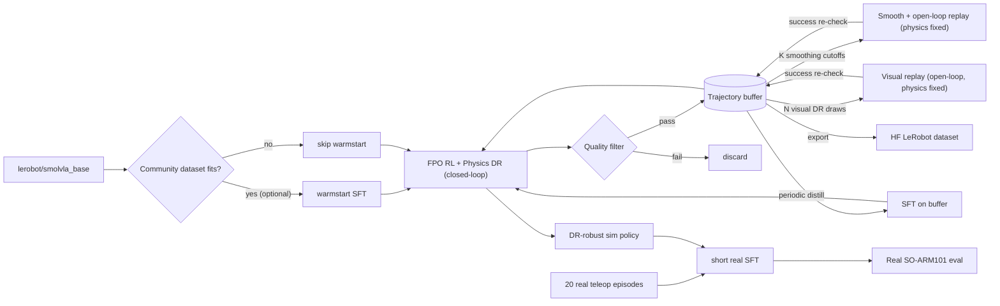

## Key idea — physics DR vs visual DR, separated

Open-loop replay of a fixed action sequence in a stochastic physics env diverges — gripper misses, block rolls differently, and the recorded `(image_t, action_t)` pair becomes a mismatch. That's a worse dataset than none.

So we split randomization by where it's safe:

- **RL (closed-loop) handles physics DR.** Mass, friction, motor noise, actuator lag — the policy can react step-by-step, so physics variation makes it *robust*.
- **Action-replay (open-loop) handles visual DR.** Textures, colors, lighting, camera intrinsics, third-person camera pose+FOV, image noise. Physics stays pinned (same MuJoCo seed, fixed mass/friction) so state trajectories are byte-identical across replays and images remain valid labels.

Wrist cam is rigidly mounted on the gripper → only lens/lighting/noise DR, never pose. Third-person cam can get full pose + FOV + lens DR.

## Trajectory quality filter (rollout-level, never mid-episode)

Four starting gates; a rollout either passes all and enters the buffer, or is dropped:

- **Success** — `info["is_success"] == True` (from the env).
- **Episode length** — `< max(1.5 × P75(human_lengths), 0.75 × max_episode_steps)`. Avoids near-timeout flailing.
- **Spike guard on action magnitude** — `max_t ||a_t||_inf < 1.5 × P99(human per-step action magnitude)`.
- **Per-second jerk** — `P95( ||(a_t - a_{t-1}) / Δt||_2 ) < 1.25 × P95(human per-second jerk)`. This is the smoothness gate; the per-second normalization makes it comparable across sim and dataset control rates.

**Thresholds come from the open SO-ARM101 teleop dataset**, not from the model's own baseline rollouts. The bar is "be at least as smooth and efficient as a human teleoperator", which is both a more honest quality standard and biases policies toward trajectories the real robot can physically execute — humans are constrained by the follower arm's real motor dynamics, so their envelope is a useful sim-to-real prior.

Thresholds live in a `FilterConfig` dataclass, computed once by `scripts/compute_filter_thresholds.py` and serialized to `results/so101_filter_config.json` so experiments are reproducible. Mid-episode clipping is explicitly forbidden because it breaks SmolVLA's flow-matching chunk contract (fixed `chunk_size=50`).

Three correctness requirements before percentiles are computed:

1. **Normalize action parametrization.** If the dataset uses raw joint positions in radians and sim uses normalized joint-delta in `[-1, 1]`, convert both to a common space (easiest: normalized joint-delta in `[-1, 1]` using per-joint min/max) before percentiles.
2. **Normalize control rate.** Jerk is Δt-dependent. Divide by Δt to get per-second jerk; compare apples to apples even if the dataset is 30 Hz teleop and sim is 50 Hz.
3. **Filter the dataset to success-only.** Early teleop sessions often contain failure or recovery episodes; these would inflate our jerk bar.

## Pipeline shape

## Why this fits this repo

- `src/vla/src/vla/rl/` is embodiment-agnostic — `vec_env.py`, `rollout.py`, `policy_update/fpo.py` consume any `SimEnv`. Dropping in `gym-lowcostrobot` is a wrapper + config change.
- `src/vla/src/vla/envs/maniskill.py` is the `SimEnv` wrapping template.
- `SmolVLAPolicy` pads to `max_action_dim=32`, so 6-DOF SO-ARM101 fits with no model edits ([src/vla/src/vla/models/smolvla.py](src/vla/src/vla/models/smolvla.py) — see `_pad_vector` / `_build_action_chunks`).
- Existing [src/vla/configs/srpo_pickcube.yaml](src/vla/configs/srpo_pickcube.yaml) is the template for `configs/srpo_so101_pick.yaml`.

## Phase 1 — sim env + DR split + buffer + filter

1. `src/vla/src/vla/envs/lowcostrobot.py`: `LowCostRobotEnv(SimEnv)` around `gym.make("PickPlaceCube-v0", ...)`, mirroring `ManiSkillEnv`:
  - 2 cameras at 256×256: wrist + overhead.
  - Joint-delta control, 6-DOF + gripper.
  - `is_success(info)` from env success flag.
  - `LowCostRobotEnvFactory` for parallel envs (spawn-mode MP like ManiSkill).
2. `src/vla/src/vla/envs/lowcostrobot_dr.py` with two separate wrappers:
  - `PhysicsDRWrapper(PhysicsDRConfig)`: mass, friction, motor torque noise, actuator lag. Applied at reset, stays constant per episode.
  - `VisualDRWrapper(VisualDRConfig)`: textures, object colors, light intensity + direction, third-person cam pose + FOV + lens, wrist cam lens + lighting + image noise. Applied at reset **and** optionally on re-render for action-replay. Wrist pose fixed at all times.
  - Three presets each: `narrow / medium / wide`. Just dataclass instances — no code change between rungs.
3. `src/vla/src/vla/rl/trajectory_store.py`: sharded append-only `.pt` store with `{images: (T,V,C,H,W) uint8, states, actions, instruction, success, physics_params, visual_params, filter_metrics, aug_source}`. `aug_source ∈ {rl, replay}`. `export_as_lerobot(repo_id)` serializes to LeRobot v3 format.
4. `src/vla/src/vla/rl/trajectory_filter.py`: `FilterConfig` dataclass + `filter_rollout(rollout, config) -> (pass: bool, metrics: dict)`. Hooked into `rl/rollout.py` so failed rollouts never reach the buffer.
5. Register `"lowcostrobot"` in [src/vla/src/vla/constants.py](src/vla/src/vla/constants.py)'s `Simulator` enum and in `diagnostics/eval.py::evaluate_smolvla` dispatch.
6. Add `gym-lowcostrobot`, `mujoco` to [src/vla/pyproject.toml](src/vla/pyproject.toml).

## Phase 2 — filter thresholds from open SO-ARM101 data

Pick **any** SO-ARM101 / SO-100 LeRobot HF dataset — **task match not required** for this step, only embodiment + joint-space teleop. Thousands of such rollouts already live on HF under `lerobot/so100`_* and similar.

Add `src/vla/scripts/compute_filter_thresholds.py`:

1. Load the dataset via `LeRobotDataset` and read its `action`, `observation.state`, and timestamp columns.
2. Filter to success-only episodes (use the env's success field if present, else keep all and flag the caveat in the output JSON).
3. Normalize action parametrization to match the sim's control mode — convert to normalized joint-delta in `[-1, 1]` using the per-joint min/max from the sim env (the lowcostrobot env exposes these on reset).
4. Compute per-second jerk using the dataset's actual Δt (from timestamps) so the result is control-rate-agnostic.
5. Write `results/so101_filter_config.json` with `{p75_length, p99_action_magnitude, p95_jerk_per_sec, dataset_repo_id, n_episodes, hz}` plus the derived threshold values (×1.5 / ×1.25 slack).

Optional sub-step (≤2 h extra timebox): **if the same dataset also has a reasonable task match** (cube-pick or similar, 2 cameras), additionally reuse it for a short warmstart SFT — add `src/vla/src/vla/data/so_arm101.py` mirroring [src/vla/src/vla/data/libero.py](src/vla/src/vla/data/libero.py)'s `LiberoSFTDataset`, plus `--so101-repo` in [src/vla/scripts/train_sft.py](src/vla/scripts/train_sft.py), plus `configs/sft_so101_warmstart.yaml`. 10 epochs. Goal: plausible joint commands, not success rate.

If no dataset is usable even for stats-only, fall back to Phase 3's baseline rollouts as the threshold source (marked as a known-weaker calibration in the results log).

## Phase 3 — sim baseline + threshold sanity-check

1. Zero-shot eval in `PickPlaceCube-v0` with no DR: record success rate as a raw baseline.
2. Run the same stats pipeline on the baseline rollouts and log `{baseline_p75_length, baseline_p99_action_magnitude, baseline_p95_jerk_per_sec}` side-by-side with the human-derived thresholds. Expected sanity signals:
  - Baseline jerk should be **noticeably higher** than human — if it's already lower, the action parametrization normalization probably has a bug.
  - Baseline lengths should be longer (random policies wander). If they're shorter, something is terminating episodes early.
3. No threshold updates here — Phase 2 already wrote the FilterConfig. Phase 3 is just a tripwire that the normalization is correct before we burn RL compute.

## Phase 4 — RL fine-tune with Physics DR ladder

`configs/srpo_so101_pick.yaml` based on [src/vla/configs/srpo_pickcube.yaml](src/vla/configs/srpo_pickcube.yaml):

- `env_id: PickPlaceCube-v0`, `simulator: lowcostrobot`, `update_method: fpo` (dense reward → FPO > AWR).
- Physics DR ladder: `narrow` (±10% mass, ±10% friction, 1% motor noise) → `medium` (±20%, ±20%, 3% + 20 ms actuator lag) → `wide` (±30%, ±30%, 5% + 50 ms + gripper compliance noise). Gate on 70 / 65 / 60 success.
- `num_envs: 8` start — MuJoCo render at 2×256² is the bottleneck.
- Every passing rollout writes to the buffer with `aug_source=rl` + its `physics_params`.
- No visual DR during RL. Visual env is the canonical one.

Seed demos: 20–50 successful rollouts of the warmstart (or base) policy; if <20% success, fall back to the env's built-in IK solver for scripted demos.

## Phase 5 — trajectory smoothing + replay validation

Constructive version of the jerk filter: instead of discarding jerky rollouts, *smooth* them and keep the ones the sim still validates. This is the cheapest data multiplier we have (pure math + MuJoCo step, no model inference) and doubles as a sim-to-real amplifier because smooth action sequences transfer far better to real hardware.

For each buffer entry with `aug_source=rl`, do K smoothing variants (K=4 to start, cutoffs at 3 / 5 / 8 / 15 Hz):

1. Apply per-joint Butterworth low-pass to the action sequence. **Gripper channel and any quantized channel stay raw** — their timing is load-bearing for grasp/release.
2. Reset env with the same physics seed + physics params as the original rollout.
3. Step open-loop through the smoothed action sequence.
4. Verify `info["is_success"] == True` at end. Expected survival: ~30–70% depending on cutoff; failures are simply discarded.
5. Append survivors to buffer with `aug_source=smoothed_replay`, `smoothing_params={type: "butter", cutoff_hz, order, gripper_exempt: true}`.

Expected per-RL-rollout multiplier after this phase: ~2–3× (out of 4 attempts, 2–3 survive on average).

**Critical:** RL policy updates (FPO) still read `aug_source=rl` only. Using smoothed actions in the FPO update would break the importance ratio because those actions weren't sampled from the policy. SFT distillation (Phase 7) reads all aug_sources.

New module: `src/vla/src/vla/rl/trajectory_smooth.py` with `SmoothingConfig` dataclass + `smooth_and_validate(rollout, env, configs) -> list[Rollout]`.

## Phase 6 — replay-based visual augmentation

Stacks on top of Phase 5. For each buffer entry with `aug_source ∈ {rl, smoothed_replay}`, do K visual replays (K=20 to start):

1. Reset env with the **same physics seed + same physics params** as the original rollout. State trajectory stays byte-identical across replays.
2. Sample a fresh `VisualDRConfig` draw from the current visual-DR preset.
3. Step the env open-loop through the (possibly smoothed) action sequence.
4. Re-render images at each step under the new visual config.
5. Verify `info["is_success"] == True` at end as a tripwire. Failure means physics isn't actually deterministic the way we think — log, abort replay, inspect. Expected rate: near-zero; non-zero is a config drift bug.
6. Append to buffer with `aug_source=visual_replay`, same `physics_params`, new `visual_params`, preserved `smoothing_params` if applicable.

Compound multiplier after Phases 5+6: roughly 1 RL rollout → ~~2.5 smoothed → ×20 visual = **~~50 diverse labeled samples** per successful RL rollout, each validated by the sim.

Visual DR ladder (narrow → medium → wide): progress alongside the physics DR ladder so we don't try to replay-learn under wide visual DR before the policy can solve narrow.

## Phase 7 — periodic distillation

Every ~10 RL iterations, short `train_sft` on the combined buffer (RL + smoothed_replay + visual_replay), weighted toward recent DR rungs. ~30 min per pass. Reduces flow-matching variance and stabilizes the next RL iteration. SFT consuming smoothed trajectories is also where the smoothness prior actually gets baked into the policy.

## Phase 8 — export and reuse

`trajectory_store.export_as_lerobot("<you>/so101_pick_sim_rollouts")` — durable HF artifact that future experiments can SFT directly on.

## Phase 9 — sim-to-real

Once leader + follower are built:

1. 20 real teleop episodes of the same task via `lerobot-record`, camera framing matched to sim.
2. Short SFT fine-tune of DR-wide sim policy at `lr=2.5e-5`, ~3–5 epochs.
3. 20 real rollouts + baseline video into `src/vla/results/`.

## Not doing yet

- Multi-task / language conditioning — single task, single instruction.
- SO-ARM101 ManiSkill port — ruled out for lowcostrobot.
- Perturbing physics during replay — explicitly out of scope; it would break the `(image_t, action_t)` validity guarantee.
- On-robot RL — only sim RL; real robot sees SFT only.

## Key risks / honesty

- **Render throughput dominates.** MuJoCo CPU + 2×256² RGB = real bottleneck on both RL and replay. Budget ~12–24 h per RL gate on L40S; A100 roughly halves. Visual replay is cheaper than RL; smoothing replay is cheapest (it's a sim step without rendering during validation — only render the survivors).
- **Physics determinism guarantee is load-bearing.** Phases 5 and 6 both depend on "same physics seed + same physics params = same state trajectory". MuJoCo supports this but any non-determinism (threaded render affecting sim order, OpenMP env vars) breaks it silently. The post-replay success re-check is the tripwire.
- **Smoothing must exempt gripper / quantized channels.** A naive low-pass on the gripper smears close/open timing and kills grasp success. Confirmed in the SmoothingConfig dataclass but easy to regress — add a unit test that asserts gripper channel is untouched.
- **FPO must see raw actions only.** If smoothed trajectories leak into the policy update, the importance ratio is wrong. Enforce via `aug_source` filter in the RL dataloader.
- **Sim-to-real gap on a low-cost arm is still large.** SO-ARM101 backlash, motor elasticity, gripper compliance aren't in the MuJoCo model even with physics DR. Phase 9 real-demo fine-tune is load-bearing, not optional.
- **Buffer storage grows fast.** RL rollouts + ~2.5× smoothing + ×20 visual replay + 2×256² uint8 frames = tens–hundreds of GB. Keep on VLA_WORK3 scratch, sharded `.pt` with compression on. Consider storing smoothed-but-not-yet-visually-replayed variants as action-only (deferred render on demand) to save disk.
- **Filter thresholds are empirical.** The human-derived thresholds from Phase 2 are starting heuristics; expect to retune after seeing Phase 3 baseline distributions and Phase 5 smoothing survival rates.

