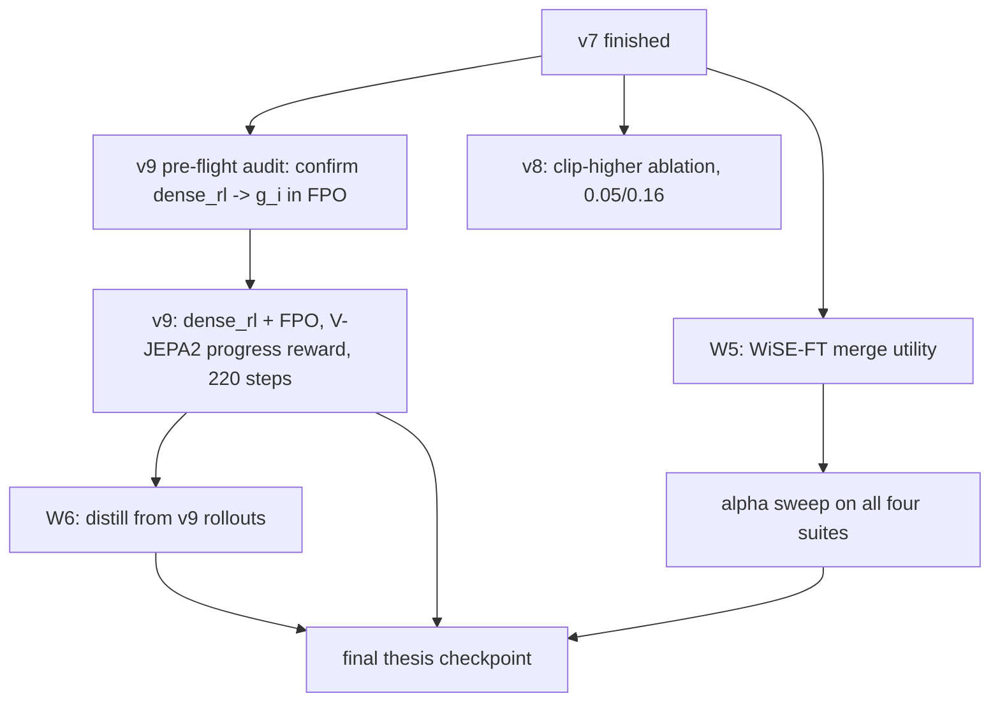

# RL-on-VLA paper recipes for LIBERO spatial 99%

Reference for how each published RL-on-VLA paper gets from sub-80% SFT to 95%+ on LIBERO.
Written so future jobs can cite a specific paper section instead of rediscovering the recipe.

> **Scope.**
> This is a *synthesis* document.
> It complements the surviving experiment summaries and tactical job settings.
> This document contributes (a) a paper-by-paper checklist of ingredients, (b) an explicit map from each ingredient to code that already exists in this repo, and (c) two proposed L40s jobs (v8, v9) that extend the existing v4/v7 FPO recipe with ingredients from πRL, SimpleVLA-RL, and SRPO.

## Table of contents

1. [TL;DR table](#1-tldr-table)
2. [Per-paper recipes](#2-per-paper-recipes)
3. [Cross-paper synthesis](#3-cross-paper-synthesis)
4. [What we already have vs what would need code](#4-what-we-already-have-vs-what-would-need-code)
5. [One-line algorithmic diffs to our current v4/v7 FPO setup](#5-one-line-algorithmic-diffs-to-our-current-v4v7-fpo-setup)
6. [Updated W1–W8 priorities with new W3b and W9](#6-updated-w1w8-priorities-with-new-w3b-and-w9)
7. [Proposed jobs — v8 (clip-higher) and v9 (SRPO dense reward)](#7-proposed-jobs--v8-clip-higher-and-v9-srpo-dense-reward)

---

## 1. TL;DR table

| Paper | Base VLA | SFT → RL on LIBERO spatial | LIBERO average | Algorithm | Reward shape | Key exploration knobs | Compute |
| --- | --- | --- | --- | --- | --- | --- | --- |
| πRL ([arXiv 2510.25889](https://arxiv.org/abs/2510.25889)) | π0 (3B) | 65.3 → 98.4 | 57.6 → 97.6 | PPO + GAE + critic, Flow-SDE / Flow-Noise | Binary outcome, chunk-level | Hybrid ODE-SDE denoise, learnable noise net | 8× H100, RLinf |
| πRL (same) | π0.5 (3B) | 84.6 → 99.6 | 77.1 → 98.3 | Same; critic on VLM output | Binary outcome, chunk-level | Same | 8× H100 |
| SimpleVLA-RL ([arXiv 2509.09674](https://arxiv.org/abs/2509.09674)) | OpenVLA-OFT (7B) | 91.7 → 99.1 (single-traj SFT → 99.1 spatial)\* | ≈91 → 99.1 | GRPO on action-token logprob | Binary outcome | Dynamic sampling, clip-higher (εL=0.2, εH=0.28), temperature 1.6, β=0 | 8× A800 |
| SRPO ([arXiv 2511.15605](https://arxiv.org/abs/2511.15605)) | OpenVLA\*-one (7B) | 48.9 → 99.2 in ≤220 RL steps (98.8 spatial by step 79) | 48.9 → 99.2 | GRPO | Dense: V-JEPA 2 latent DBSCAN progress reward | β > 0 (KL-to-ref kept), traj-level advantage | not reported, single-node |
| RLinf-VLA ([arXiv 2510.06710](https://arxiv.org/abs/2510.06710)) | multiple | 51.6 → 98.69 avg (unifies π0, OpenVLA-OFT, etc.) | 51.6 → 98.69 | PPO + GRPO (unified) | Binary outcome | Hybrid fine-grained pipeline (infra), consistent across archs | multi-node |
| PLD ([OpenReview eUGoqrZ6Ea](https://openreview.net/forum?id=eUGoqrZ6Ea)) | OpenVLA-OFT | ≈ matched SFT → ≈99 avg | ≈99 | Probe → residual off-policy RL in failures → SFT distill | Binary outcome + state visitation | Residual actor limited to failure states | modest |
| RIPT-VLA ([arXiv 2505.17784](https://arxiv.org/abs/2505.17784)) | OpenVLA-OFT | — → 97.5 avg | — → 97.5 | REINFORCE Leave-One-Out (RLOO) | Binary outcome | Dynamic sampling, single-stage RL | modest |

\* SimpleVLA-RL's headline SFT → RL delta is on Long / single-traj regimes where SFT is starved; the ≈91 → 99 number is their LIBERO-average across suites after RL.

**Common starting point across 95%+ results**:
image + wrist camera + proprioception, action chunking 8–10 with temporal ensembling, some form of trust-region + reference KL or SFT anchor, and at least one of {dynamic sampling, clip-higher, dense progress reward, distillation from rollouts}.

---

## 2. Per-paper recipes

### 2.1 πRL — Flow-SDE + PPO on π0 / π0.5

Paper: [arXiv 2510.25889](https://arxiv.org/abs/2510.25889).

- **Architecture.** Freezes VLM. Trains only the 300M *action expert*, which is the flow-matching diffusion head.
- **Flow-SDE.** Reinterprets a flow-matching sampler as one of two SDE formulations so that action sampling is stochastic (required for on-policy exploration):
  - *Flow-Noise*: learnable noise network, gives exact log-lik for PPO.
  - *Flow-SDE (hybrid ODE-SDE)*: one randomly chosen denoising step per env-step is stochastic, the rest deterministic; keeps FM-step cost flat.
- **Algorithm.** PPO + GAE + learned critic.
  - For π0.5 the critic is attached to the VLM output (semantic features).
  - For π0 the critic is the average over the flow trajectory τ.
- **Reward shape.** Binary outcome, **chunk-level**: the entire action chunk is treated as one macro-step and per-step rewards are summed into one chunk reward.
- **Compute.** 8× H100, RLinf codebase.

What this means for us:

- SmolVLA already freezes the VLM via `train_expert_only=True` — the action-expert-only assumption is free.
- Our FPO path already treats the chunk as the unit of update (chunk-level loss and advantage).
- **Delta vs πRL is that πRL uses a PPO critic**; our FPO path is critic-free (likelihood-free ratio).
- Flow-SDE's hybrid ODE-SDE is implicit in FPO's noise-sample treatment but not identical; πRL is a reasonable upper bound of what critic-based flow-matching RL can do.

### 2.2 SimpleVLA-RL — DAPO ingredients on OpenVLA-OFT

Paper: [arXiv 2509.09674](https://arxiv.org/abs/2509.09674).

- **Architecture.** OpenVLA-OFT (7B), action-token LM head.
- **Algorithm.** GRPO with the three DAPO-style exploration enhancements, all three shown ablated-on helpful:
  - **Dynamic sampling.** Keep resampling until every group has mixed outcomes (at least one success + one failure in each group). Their ablation: significant drop when disabled, especially on Long.
  - **Clip-higher (DAPO).** Asymmetric PPO clip with `εL = 0.2, εH = 0.28`. The upper clip is widened so that low-probability actions can still grow under positive advantage; the lower clip stays tight to keep the trust region.
  - **Higher rollout temperature.** `T = 1.6` at rollout time.
- **Reference KL.** `β = 0`. No KL anchor to a reference. Opposite of what SRPO does.
- **Reward shape.** Binary outcome, per-group leave-one-out advantage baseline.
- **Hyperparams.** `lr = 5e-6`, batch 64, G = 8, mini-batch 128, action chunk 8, 8× A800.

What this means for us:

- W3 dynamic sampling in our trainer already matches the *intent* of SimpleVLA's dynamic sampling, but our implementation **retries only uniform tasks** whereas SimpleVLA resamples the whole batch until every group is mixed.
  - Practically the difference matters when many tasks simultaneously saturate or collapse.
  - For v1–v7 on LIBERO spatial, `skipped_tasks` has typically been small, so per-task retry is a reasonable approximation.
- Our current v4/v7 clip values are `0.05 / 0.08`, which is **FPO-appropriate and slightly asymmetric** but with a much smaller gap (ratio ~1.6) than DAPO's 1.4 (but on much wider values).
  - Porting DAPO's 0.2 / 0.28 *verbatim* into FPO would blow up the trust region: our ratio is an FM-loss ratio, which has different dynamics than GRPO's token-prob ratio.
  - The cheap next experiment is to widen only the upper side while keeping 0.05 on the lower side, to test whether positive-advantage, low-probability actions are currently being over-clipped. **This is v8.**
- Higher rollout temperature is not exposed today in `libero_rollout.py`; adding a `--rollout-temperature` flag is a small plumbing change. **This is W9.**

### 2.3 SRPO — V-JEPA2 latent world-model progress reward

Paper: [arXiv 2511.15605](https://arxiv.org/abs/2511.15605).

- **Architecture.** OpenVLA\*-one (7B), single-image variant.
- **Algorithm.** GRPO with **KL-to-ref kept** (β > 0) and a trajectory-level advantage.
- **Reward shape — the key idea.**
  1. Encode every trajectory's observations with a V-JEPA 2 encoder.
  2. Run **DBSCAN** on the latent trajectories of successful rollouts to get success cluster centers.
  3. For each failure, reward = sigmoid-squashed, z-score-normalized L2 distance in latent space to nearest success cluster center.
  4. Successes keep reward 1.0 (with α = 0.8 scaling on the failure branch).
  5. The per-trajectory `g_i` replaces the binary outcome in the advantage normalization.
- **Result.** 48.9 → 99.2 on LIBERO average in ≤ 220 RL steps. Spatial reaches 98.8 in 79 steps, Long reaches 98.6 in 219 steps. This is the only paper in the table that starts **lower** than our current 80% baseline and ends *above* 99%.
- **Ablation.** Without the V-JEPA progress signal, the same pipeline with pixel-level or ImageBind rewards tops out around 85% (Fig. 4 / Table 3 of the paper).

What this means for us:

- `src/vla/src/vla/rl/srpo_reward.py::MultiTaskWorldProgressReward` and `src/vla/src/vla/models/world_model.py` already implement this reward, with a `WorldModelEncoder` that supports both DINOv2 and V-JEPA2.
- It is wired behind `--mode dense_rl`. It is **not** wired into the current `sparse_rl` + FPO pipeline used by v1–v7.
- SRPO's reward is the **single largest missing ingredient** that separates us from the 99%+ cluster, given that the paper explicitly shows this reward is what converts their 85% ceiling into the 99% one.
- A pre-flight audit step: confirm that `scripts/train_srpo.py` with `--mode dense_rl` instantiates `MultiTaskWorldProgressReward` through FPO's update path and passes `g_i` into advantage normalization. The `trainer.py` imports already exist; the concrete concern is whether FPO consumes `g_i` (the dense reward) rather than the binary outcome as the advantage target.

### 2.4 RLinf-VLA — mostly infrastructure

Paper: [arXiv 2510.06710](https://arxiv.org/abs/2510.06710).

- **Contribution.** Unified interface for VLA architectures (OpenVLA, OpenVLA-OFT, π0, SmolVLA-like), RL algos (PPO, GRPO), and simulators (LIBERO, ManiSkill, RoboTwin).
- **Systems.** Hybrid fine-grained pipeline allocation, 1.61–1.88× throughput on multi-GPU.
- **Result.** 51.6 → 98.69 avg on LIBERO with consistent 20–85% relative gains across LIBERO / ManiSkill / RoboTwin on many different VLA backbones.
- **Algorithmically** this paper reuses PPO and GRPO. There is no new algorithm here — only the "training practices" appendix and a strong argument that the LIBERO 99% regime is now reproducible across architectures with correct infra and hyperparameters.

Practical takeaway: we can steal their training-practice appendix, not a new algorithm. Useful as a citation that confirms the LIBERO 99% regime is **architecture-independent** once the ingredients above are in place.

### 2.5 PLD — Probe, Learn, Distill

Paper: [OpenReview eUGoqrZ6Ea](https://openreview.net/forum?id=eUGoqrZ6Ea).

- **Stage 1 — Probe.** Deploy the SFT VLA and instrument failure states (state-visitation logging at rollout time).
- **Stage 2 — Learn.** Train a *small residual actor* off-policy in those failure states only. The residual actor adds a correction on top of the frozen SFT VLA's action chunk.
- **Stage 3 — Distill.** Generate hybrid rollouts (VLA + residual correction) and SFT-distill them back into the base VLA.
- **Result.** ≈99% on LIBERO average.

What this means for us:

- W6 in the thesis plan already proposes the "distill from rollouts" half (Stage 3-like).
- The residual-actor half (Stage 2) is a separate and larger code change. It is the differentiator of PLD vs plain self-distillation, but it is not required to get a first working distillation pass.
- Suggested sequencing: do W6 minus residual actor first (uses RL rollouts, not residual rollouts). Only add the residual actor if the simple distillation does not close the gap.

### 2.6 RIPT-VLA — Reinforcement Interactive Post-Training with Leave-One-Out

Paper: [arXiv 2505.17784](https://arxiv.org/abs/2505.17784).

- **Algorithm.** REINFORCE Leave-One-Out (RLOO). Identical to the per-task leave-one-out advantage mode we already ship in `src/vla/src/vla/rl/advantage.py`.
- **Reward shape.** Binary outcome.
- **Result.** 97.5 on LIBERO avg from OpenVLA-OFT.
- **Closest published analogue to our current setup.** RIPT-VLA = our `--advantage-mode leave_one_out` with a standard policy-gradient objective and without FPO's likelihood-free ratio.

Implication: our v4/v7 FPO + leave-one-out recipe is algorithmically in the same family as RIPT-VLA. RIPT-VLA reaching 97.5 is evidence that leave-one-out is not the bottleneck.

---

## 3. Cross-paper synthesis

### 3.1 What every 95%+ RL-on-VLA paper has

| Ingredient | πRL | SimpleVLA-RL | SRPO | RLinf-VLA | PLD | RIPT-VLA |
| --- | --- | --- | --- | --- | --- | --- |
| Freezes VLM backbone during RL | yes (action expert only) | partial (LoRA on LM head) | yes | configurable | yes | yes |
| Action chunking (≥8 actions per step) | yes | yes | yes | yes | yes | yes |
| Chunk-level reward treatment | yes | yes | yes | yes | yes | yes |
| Trust-region or KL anchor | PPO clip + GAE | PPO clip (DAPO) | PPO clip + β > 0 | PPO/GRPO clip | SFT anchor via distill | PPO clip |
| Reference-KL to SFT | implicit via critic | β = 0 | β > 0 | config | via distillation | small |
| Dynamic sampling of uniform-reward groups | — | yes | implicit | yes (in appendix) | N/A | yes |
| Clip-higher (asymmetric PPO clip) | — | yes (0.2 / 0.28) | — | yes (optional) | — | — |
| Higher rollout temperature | stochastic SDE serves as temp | yes (T=1.6) | default | default | — | — |
| Dense reward beyond binary outcome | no | no | **yes (V-JEPA2 DBSCAN)** | no | residual actor adds shaping | no |
| Distillation from rollouts | — | — | — | — | **yes** | — |
| Weight interpolation / model soup | — | — | — | — | — | — |

Conclusions:

- **Dynamic sampling** and **clip-higher** appear in ≥3 of the 95%+ recipes and are cheap to add. They are table stakes.
- **Dense progress reward** appears in exactly one recipe (SRPO) and is exactly the step that pushes 85% → 99%.
- **Distillation from rollouts** appears in exactly one recipe (PLD) and is the alternative path to 99% if the RL policy itself saturates earlier.
- **Weight interpolation** (WiSE-FT / Model Soup) is **not** a published ingredient for any 99% LIBERO result, but it is zero-cost and well-motivated from the OOD literature — this is the unique thesis contribution our plan already claims in W5.

### 3.2 Where our repo stands vs the full ingredient list

| Ingredient | Status in repo | Notes / pointers |
| --- | --- | --- |
| VLM freeze | ✅ have | SmolVLAPolicy with `train_expert_only=True` |
| Action chunking ≥ 8 | ✅ have | Chunk length configurable via SmolVLA config |
| Chunk-level reward | ✅ have | `libero_rollout.py` returns per-chunk binary reward |
| PPO-style clip + FPO ratio | ✅ have | `policy_update/fpo.py` (clip on FM-loss ratio) |
| Leave-one-out advantage | ✅ have | `advantage.py::leave_one_out_advantages_per_task` |
| SFT-KL anchor | ✅ have | `--sft-kl-coeff` on FPO update |
| Reference-KL (β > 0) to SFT init | ✅ have | `--kl-coeff` |
| Success replay + demos | ✅ have | `demo_replay.py`, `--success-replay-total-size`, `--include-demos-in-update` |
| Dynamic sampling | ✅ have (per-task retry) | `--dynamic-sampling`, `--dynamic-sampling-max-retries`; slight deviation from SimpleVLA which re-rolls the whole batch |
| Clip-higher (asymmetric) | ✅ have, not yet widened | `--clip-epsilon / --clip-epsilon-high`, currently 0.05 / 0.08 on v4/v7. v8 widens upper to 0.16. |
| Higher rollout temperature | ❌ missing | Not exposed in `libero_rollout.py`; W9 below |
| Dense V-JEPA progress reward | ✅ implemented, ❌ not wired into FPO | `MultiTaskWorldProgressReward` + `WorldModelEncoder(kind="vjepa2")` exist; only used in `--mode dense_rl`, not yet plumbed through the FPO update path used in v1–v7. v9 tests this. W3b workstream below. |
| Distillation from rollouts | ❌ missing (planned W6) | No `behavior_clon` module in `src/vla/src/vla/rl/` |
| Residual actor (PLD Stage 2) | ❌ missing | Would be a separate policy head; not required for a first distillation pass |
| WiSE-FT weight interpolation | ❌ missing (planned W5) | Checkpoints are plain `model_state_dict`, merge is a dozen lines |
| Model soup across seeds | ❌ missing (W5 follow-on) | Trivial follow-on once WiSE-FT utility exists |
| PPO critic (πRL style) | ❌ missing | FPO is critic-free by design; not a planned addition |

---

## 4. What we already have vs what would need code

Restated as a terse mapping, organised by code area:

- `src/vla/src/vla/rl/policy_update/fpo.py`
  - ✅ likelihood-free FPO ratio, asymmetric clip, SFT-KL, reference-KL, negative-advantage scaling.
  - ⚠️ does not consume a **dense** `g_i` as advantage target; treats advantage as computed from binary outcome.
  - **v9 change**: confirm (and, if needed, adjust) FPO to use `g_i` from `MultiTaskWorldProgressReward` rather than binary outcome when `--mode dense_rl` is active.
- `src/vla/src/vla/rl/trainer.py`
  - ✅ imports both `leave_one_out_advantages_per_task` and `MultiTaskWorldProgressReward`.
  - ⚠️ need to confirm the dense path replaces the outcome-based advantage, not just adds a side reward.
- `src/vla/src/vla/rl/srpo_reward.py`
  - ✅ full SRPO reward: V-JEPA2 encoder, DBSCAN clustering, sigmoid-squashed z-score distance, α = 0.8 scaling, per-task cluster cache.
  - Nothing to add for v9 beyond activation.
- `src/vla/src/vla/rl/advantage.py`
  - ✅ `normalize_advantages_per_task`, `leave_one_out_advantages_per_task`.
  - Nothing to change.
- `src/vla/src/vla/rl/libero_rollout.py`
  - ❌ no `rollout_temperature` knob.
  - W9: add `--rollout-temperature` (and pass through to SmolVLA sampler).
- `src/vla/src/vla/rl/config.py`
  - ✅ `world_model_type: WorldModelType = WorldModelType.VJEPA2` default; `--world-model vjepa2` selectable.
- `src/vla/scripts/train_srpo.py`
  - ✅ `--mode sparse_rl | dense_rl` plumbing present.
  - ⚠️ v9 pre-flight: run a 1–2 iteration smoke with `--mode dense_rl` and verify `g_i` is what FPO sees.
- `src/vla/scripts/merge_checkpoints.py` — not yet created (W5).
- `src/vla/src/vla/data/rollout_distill.py` — not yet created (W6).

---

## 5. One-line algorithmic diffs to our current v4/v7 FPO setup

Each line below is "what v7 does today" vs "what the paper does":

- vs **πRL**: we are FPO (critic-free); πRL is PPO + critic on VLM features. Both freeze VLM and treat chunks as one step.
- vs **SimpleVLA-RL**: we are FPO + leave-one-out + SFT-KL anchor. SimpleVLA is GRPO + β=0 + clip-higher (0.2/0.28) + temperature 1.6 + full-batch dynamic sampling.
- vs **SRPO**: we are FPO + binary outcome reward. SRPO is GRPO + V-JEPA2 DBSCAN dense progress reward + β > 0.
- vs **RLinf-VLA**: we are single-node FPO. RLinf-VLA is multi-node PPO/GRPO via a unified scheduler.
- vs **PLD**: we have no residual actor and no distillation. PLD is residual off-policy RL in failure states + SFT distillation.
- vs **RIPT-VLA**: we are FPO + leave-one-out; RIPT-VLA is REINFORCE-LOO (same advantage structure, simpler objective).

---

## 6. Updated W1–W8 priorities with new W3b and W9

The deltas below are proposed additions or re-orderings motivated by the cross-paper synthesis above.

- **W1 — Finish what is running.** Unchanged. Finish v7 / v4 promo evals first.
- **W2 — FPO noise-sample ablation.** *Defer* until after W3b lands.
  - Motivation: noise-sample=1 is a variance-reduction row in the ablation table; the current N=4 job is sufficient to close the primary row. Spending a 24 h L40s slot on a pure variance ablation while we have not yet tested the single highest-leverage ingredient (SRPO dense reward) is a prioritization error.
- **W3 — Dynamic sampling.** ✅ already implemented and live in v7. Keep as-is. Optional follow-up: whole-batch resample mode to match SimpleVLA exactly, gated behind a CLI flag.
- **W3b — NEW. Dense SRPO progress reward wired into FPO.**
  - Motivation: SRPO is the only paper that reaches 99% from a *lower* starting point than us, **specifically because** of the V-JEPA progress signal. Their own ablation shows an 85% ceiling without it.
  - We already have the encoder (`world_model.py`) and the reward class (`srpo_reward.py::MultiTaskWorldProgressReward`). Plumbing into `policy_update/fpo.py` via `SRPOConfig` is a trainer-level change, not a new paper.
  - Pre-flight: confirm `--mode dense_rl` in `scripts/train_srpo.py` instantiates `MultiTaskWorldProgressReward` **and** that FPO consumes `g_i` rather than the binary outcome.
  - Deliverable: v9 run (see §7.2).
- **W4 — Per-task rebalancing.** Unchanged. Additive to W3 / W3b.
- **W5 — WiSE-FT interpolation utility.** Keep high. Add a note that **Model Soups across v4/v7 seeds** is a zero-cost follow-on once the merge utility exists.
- **W6 — Self-distillation with perturbations.** *Defer* until after W3b lands.
  - Motivation: distillation without a stronger RL policy just distills SFT. Only after v9 (SRPO-reward + FPO) produces a policy meaningfully above the 80% baseline does distillation-from-rollouts become informative.
- **W7 — Cross-suite eval and LIBERO-Plus / LIBERO-PRO.** Unchanged.
- **W8 — Plotting for the headline figure.** Unchanged.
- **W9 — NEW. Expose `--rollout-temperature` in `libero_rollout.py`.**
  - Motivation: SimpleVLA-RL's cheapest ablated-on-helpful knob. Not currently exposed in our rollout code.
  - Scope: add a `rollout_temperature: float = 1.0` argument to the libero rollout loop, thread it through to the SmolVLA action sampler, default to 1.0 (no behavior change), expose as `--rollout-temperature` on `scripts/train_srpo.py` and `scripts/evaluate.py`.
  - Estimated effort: ~30 minutes of plumbing + 1 smoke run. Worth doing *before* any ablation of exploration strategy.

Dependency update vs the current thesis plan DAG:



---

## 7. Proposed jobs — v8 (clip-higher) and v9 (SRPO dense reward)

Both mirror the Job-4 wall-clock envelope (24 h L40s, `--iterations 30 --eval-every 15 --eval-episodes 20 --gradient-checkpointing --max-steps 220`) used in v4 / v7.

Promoting either of these code blocks to a real file is a one-command copy:

```bash
cp <embedded snippet here> src/vla/jobs/sparse_fpo_spatial_all_v8_l40s.sh
cp <embedded snippet here> src/vla/jobs/dense_srpo_spatial_all_v9_l40s.sh
```

### 7.1 v8 — `sparse_fpo_spatial_all_v8_l40s.sh` (clip-higher ablation)

**Delta vs v4/v7**: widen the upper clip while holding the lower.

- `--clip-epsilon 0.05` (unchanged)
- `--clip-epsilon-high 0.16` (was `0.08`)

Rationale:
DAPO and SimpleVLA-RL use `0.2 / 0.28` on a GRPO *token-probability* ratio.
Our FPO clip acts on an FM-loss-based ratio, which has different dynamics (it is not a log-probability ratio), so a 1:1 port is wrong and likely unstable.
`0.05 / 0.16` preserves the **same direction** as DAPO (widen upper, tight lower; εH / εL ≈ 3.2, vs DAPO's 1.4 on wider base values) while keeping the lower bound where v4/v7 already worked.
It is a cheap 1-run ablation.
Re-run with `0.05 / 0.25` only if `0.16` is clearly safe and we still see evidence of over-clipping on positive advantages.

Job script (clone of v7 with the upper clip widened and the `wandb_name` suffix renamed to `-cliphigh016`):

```bash
#!/bin/sh

#BSUB -J sparse_fpo_spatial_all_v8
#BSUB -q gpul40s
#BSUB -W 24:00
#BSUB -n 16
#BSUB -R "span[hosts=1]"
#BSUB -R "rusage[mem=4GB]"
#BSUB -gpu "num=1:mode=exclusive_process"
#BSUB -u s234814@dtu.dk
#BSUB -B
#BSUB -N
#BSUB -oo logs/sparse_fpo_spatial_all_v8/%J.out

. jobs/_env.sh

export LIBERO_PATH=/work3/s234814/libero
mkdir -p "$LIBERO_PATH"
printf "Y\n/work3/s234814/libero\nY\n" | uv run python -c "import libero.libero; print('Libero configured')"

uv run python scripts/train_srpo.py \
  --checkpoint HuggingFaceVLA/smolvla_libero \
  --simulator libero \
  --suite spatial \
  --libero-suite spatial \
  --task-ids all \
  --mode sparse_rl \
  --update-method fpo \
  --advantage-mode leave_one_out \
  --seed 42 \
  --lr 2e-06 \
  --max-grad-norm 10.0 \
  --iterations 30 \
  --trajs-per-task 32 \
  --num-rollout-envs 8 \
  --fm-batch-size 64 \
  --ppo-epochs 1 \
  --clip-epsilon 0.05 \
  --clip-epsilon-high 0.16 \
  --num-fm-noise-samples 4 \
  --fpo-negative-adv-scale 1 \
  --kl-coeff 0.01 \
  --sft-kl-coeff 0.02 \
  --include-demos-in-update \
  --success-replay-total-size 320 \
  --success-replay-alpha 1.0 \
  --success-replay-ema-decay 0.8 \
  --success-replay-max-ratio 0.5 \
  --adv-eps 1e-8 \
  --adv-skip-threshold 1e-6 \
  --dynamic-sampling \
  --dynamic-sampling-max-retries 2 \
  --eval-every 15 \
  --eval-episodes 20 \
  --max-steps 220 \
  --gradient-checkpointing \
  --wandb-name "spatial-all-v8-lr2e6-sftkl002-replay320-demos-dynsample-cliphigh016" \
  --wandb
```

### 7.2 v9 — `dense_srpo_spatial_all_v9_l40s.sh` (SRPO progress reward + FPO)

**Delta vs v4/v7**:

- Switch `--mode sparse_rl` → `--mode dense_rl`.
- Point the reward to the already-implemented `MultiTaskWorldProgressReward` (V-JEPA2 encoder).
- Keep the v4/v7 optimization recipe otherwise (`lr 2e-6`, `sft_kl 0.02`, `--include-demos-in-update`, replay 320 + max-ratio 0.5, `num_fm_noise_samples 4`, dynamic sampling on).

New CLI flags this job uses (the exact names need the pre-flight verification listed below):

- `--world-model vjepa2` — already supported by `config.py` (`WorldModelType.VJEPA2`).
- `--world-progress-reward` — or whatever existing flag activates `MultiTaskWorldProgressReward` inside `scripts/train_srpo.py` under `--mode dense_rl`. Verify the precise flag during pre-flight and update this script accordingly.

**Pre-flight before v9 runs** (audit step, *not* code changes):

1. Confirm that `scripts/train_srpo.py --mode dense_rl` actually instantiates `MultiTaskWorldProgressReward` and wires it through FPO's update path.
2. Confirm the per-trajectory dense reward `g_i` is the quantity passed into advantage normalization (not an auxiliary side channel while binary outcome still drives advantages).
3. Smoke test on a single iteration: inspect one logged `mean_reward` / `advantage` tensor and verify it takes continuous values in `[0, 1]` for failures (not just `{0, 1}`).

Pointers for the audit: `src/vla/src/vla/rl/trainer.py` (imports both `leave_one_out_advantages_per_task` and `MultiTaskWorldProgressReward`), `src/vla/src/vla/rl/srpo_reward.py`, `src/vla/src/vla/rl/config.py` (for the `--world-model` / `SRPOConfig` surface), and `src/vla/src/vla/rl/policy_update/fpo.py` (does the consumer of advantage care about dense vs binary?).

Job script (clone of v7 with `--mode dense_rl`, V-JEPA2 encoder, and renamed suffix):

```bash
#!/bin/sh

#BSUB -J dense_srpo_spatial_all_v9
#BSUB -q gpul40s
#BSUB -W 24:00
#BSUB -n 16
#BSUB -R "span[hosts=1]"
#BSUB -R "rusage[mem=4GB]"
#BSUB -gpu "num=1:mode=exclusive_process"
#BSUB -u s234814@dtu.dk
#BSUB -B
#BSUB -N
#BSUB -oo logs/dense_srpo_spatial_all_v9/%J.out

. jobs/_env.sh

export LIBERO_PATH=/work3/s234814/libero
mkdir -p "$LIBERO_PATH"
printf "Y\n/work3/s234814/libero\nY\n" | uv run python -c "import libero.libero; print('Libero configured')"

uv run python scripts/train_srpo.py \
  --checkpoint HuggingFaceVLA/smolvla_libero \
  --simulator libero \
  --suite spatial \
  --libero-suite spatial \
  --task-ids all \
  --mode dense_rl \
  --world-model vjepa2 \
  --world-progress-reward \
  --update-method fpo \
  --advantage-mode leave_one_out \
  --seed 42 \
  --lr 2e-06 \
  --max-grad-norm 10.0 \
  --iterations 30 \
  --trajs-per-task 32 \
  --num-rollout-envs 8 \
  --fm-batch-size 64 \
  --ppo-epochs 1 \
  --clip-epsilon 0.05 \
  --clip-epsilon-high 0.08 \
  --num-fm-noise-samples 4 \
  --fpo-negative-adv-scale 1 \
  --kl-coeff 0.01 \
  --sft-kl-coeff 0.02 \
  --include-demos-in-update \
  --success-replay-total-size 320 \
  --success-replay-alpha 1.0 \
  --success-replay-ema-decay 0.8 \
  --success-replay-max-ratio 0.5 \
  --adv-eps 1e-8 \
  --adv-skip-threshold 1e-6 \
  --dynamic-sampling \
  --dynamic-sampling-max-retries 2 \
  --eval-every 15 \
  --eval-episodes 20 \
  --max-steps 220 \
  --gradient-checkpointing \
  --wandb-name "spatial-all-v9-lr2e6-sftkl002-replay320-demos-dynsample-densevjepa2" \
  --wandb
```

> The exact `--world-progress-reward` flag name is a placeholder pending the pre-flight audit above.
> If `--mode dense_rl` alone is sufficient to activate `MultiTaskWorldProgressReward` (because the `SRPOConfig` default already chooses the world-progress path in dense mode), drop `--world-progress-reward` from the script.

---

## 8. Chunk-execution rollouts — `--n-action-steps`

SmolVLA is a flow-matching policy whose `predict_action` samples a full chunk of `chunk_size = 50` actions per forward pass, but the legacy rollout loop in `vla.rl.rollout.collect_single_episode` only executes the **first** action of each chunk and then re-samples, discarding the other 49.
That wastes ~98% of rollout compute and also trains the FPO/AWR loss on 49 chunk positions the policy never committed to, which is just noise.

The `--n-action-steps H` flag on `scripts/train_srpo.py` (propagated to `SRPOConfig.n_action_steps`) switches the rollout to **chunk execution**:
each policy query emits one chunk, the first `H` actions are stepped into the environment, and then the policy is re-queried.
Trajectories record one transition per *decision point*, with `Trajectory.executed_chunks` of shape `(T_dec, H, action_dim)` and `Trajectory.chunk_mask` of shape `(T_dec, H)`.

The loss path is decision-point aligned and mask-aware:

- `SmolVLAPolicy._build_action_chunks` detects a 3D executed-chunk input and pads it to `(T_dec, chunk_size, max_action_dim)`, setting the per-position mask to `True` only for the `H` executed positions and `False` for all unexecuted chunk positions.
- `compute_fm_loss_batched` / `compute_fm_loss_multi_sample` (and their KV/prefix-cache variants) accept a `chunk_mask` kwarg and multiply the per-position flow-matching loss by the mask before reducing, so the unexecuted tail of the sampled chunk contributes zero gradient.
- `vla.rl.policy_update.base._actions_and_mask_for_loss` transparently picks the right path: trajectories with `executed_chunks` populated go through the chunked loss, everything else (demos, legacy SFT trajectories, single-step rollouts) falls back to the existing shifting-chunk builder.

Expected trade-offs (see the SimpleVLA-RL comparison earlier in this doc and the assistant analysis in the accompanying PR):

- Rollout compute scales as ~1/H — at `H=10` on a 500-step LIBERO episode, roughly 50 policy forward passes per episode instead of 500.
- Decision points per iteration drop by the same factor: 32 trajs × 50 decisions = 1600 transitions (at H=10) instead of 32 × 500 = 16000.
- Starting small is safer because an H-step open-loop window lets early-training noisy policies drift before they can react.
- Eval (`evaluate_and_checkpoint`) is left at single-step execution to preserve comparability with the SFT baseline.

Suggested rollout sequence (post resume validation):

1. `--n-action-steps 1` (default, no behaviour change) — smoke run to confirm the new code path is wired up identically to pre-change.
2. `--n-action-steps 5` — sanity A/B vs baseline at equal iteration budget; watch `fpo/ratio`, `fpo/clip_frac`, and `rollout/success_rate`.
3. `--n-action-steps 10 --trajs-per-task 8 --iterations 120` — the "compound" cell from the SimpleVLA-RL comparison, expected ~20× wall-clock speedup vs today at roughly matched decision-point density.

## Citations

- πRL — [arXiv 2510.25889](https://arxiv.org/abs/2510.25889).
- SimpleVLA-RL — [arXiv 2509.09674](https://arxiv.org/abs/2509.09674).
- SRPO — [arXiv 2511.15605](https://arxiv.org/abs/2511.15605).
- RLinf-VLA — [arXiv 2510.06710](https://arxiv.org/abs/2510.06710).
- PLD — [OpenReview eUGoqrZ6Ea](https://openreview.net/forum?id=eUGoqrZ6Ea).
- RIPT-VLA — [arXiv 2505.17784](https://arxiv.org/abs/2505.17784).
- DAPO (clip-higher origin) — [NeMo-RL DAPO guide](https://docs.nvidia.com/nemo/rl/latest/guides/dapo.html).
- FPO — [arXiv 2510.09976](https://arxiv.org/abs/2510.09976).
- WiSE-FT — [arXiv 2109.01903](https://arxiv.org/pdf/2109.01903).
- Model Soups — [arXiv 2203.05482](http://arxiv.org/abs/2203.05482v3).

Local paper overviews in this repo:

- [srpo_paper_overview.md](./srpo_paper_overview.md)
- [simplevla_rl_paper_overview.md](./simplevla_rl_paper_overview.md)
- [ript_vla_paper_overview.md](./ript_vla_paper_overview.md)
- [fpo_flow_matching_policy_optimization_overview.md](./fpo_flow_matching_policy_optimization_overview.md)
- [fpo_hyperparameter_experiments.md](./fpo_hyperparameter_experiments.md)
- [RLT_pi.md](./RLT_pi.md)
