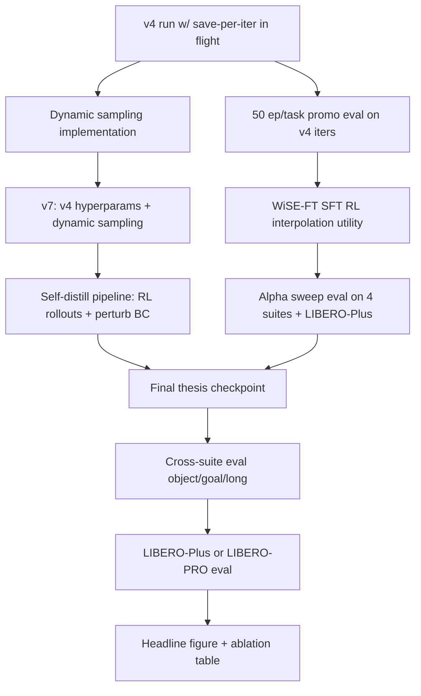

# Thesis Research Plan — RL fine-tuning of SmolVLA on LIBERO

This document is the master research plan for the thesis contribution.
It supersedes `libero_spatial_rl_experiment_plan.md` as the top-level direction and is referenced from it.
Tactical job-level notes and iteration tracking still live in that tactical plan.

## Table of contents

1. [Direct answers to the four open questions](#1-direct-answers-to-the-four-open-questions)
2. [Thesis contribution framing](#2-thesis-contribution-framing)
3. [Prioritized workstreams (W1–W8)](#3-prioritized-workstreams-w1w8)
4. [Run schedule (next 2–3 weeks, L40s / A100)](#4-run-schedule-next-23-weeks-l40s--a100)
5. [Citation index](#5-citation-index)

---

## 1. Direct answers to the four open questions

### 1a. Is it safe to drop `--num-fm-noise-samples` from 4 to 1?

**Short answer: yes for FPO, with a caveat — it raises gradient variance, not bias.**

The flag is only consumed by FPO (AWR/PPO force `n_noise_samples = 1`).
Each extra sample draws one `(noise, time)` pair from `Beta(1.5, 1.0)` and is averaged into the per-timestep FM loss that enters the PPO-style ratio.

Consequences of N=1 vs N=4:

- The FM-loss-based log-ratio becomes a noisier Monte Carlo estimate of the expected FM loss.
- This yields higher `clip_frac` variance and more unstable updates on small-advantage trajectories.
- The [FPO paper](https://arxiv.org/abs/2510.09976) explicitly notes the likelihood-free ratio is noise-sensitive and recommends multi-sample estimation.
- Compute scales linearly: N=1 is roughly 4× faster on the update step; for a 9-iteration/24 h run that is the difference between finishing and timing out.

**Recommendation for the thesis**: keep N=4 on runs that are the basis of thesis numbers; use N=1 only for fast debug sweeps or when you want to explicitly budget more iterations and accept louder curves.
Do not report a final thesis number from an N=1 run without a seed-replication sanity check.

### 1b. How do other papers hit 99% on LIBERO?

Two patterns dominate the published 95%+ results on LIBERO-spatial:

- **Big SFT** with enough data, the right head, and the right inputs: π0.5 98.8 spatial, OpenVLA-OFT 97.6, VLA-0 97.0, GR00T-N1.6 97.65.
- **Small SFT + RL**, which is where the thesis opportunity lives:
  - πRL (π0 + Flow-SDE + PPO): 65.3 → 98.4 on spatial ([arXiv 2510.25889](https://arxiv.org/html/2510.25889v2)).
  - SimpleVLA-RL: 95.3 → 99.1 with DAPO ingredients ([arXiv 2509.09674](https://arxiv.org/html/2509.09674v1)).
  - SRPO: 48.9 → 99.2 in 200 RL steps with dense progress rewards from V-JEPA2 alignment ([arXiv 2511.15605](https://arxiv.org/abs/2511.15605)).
  - RLinf-VLA: 51.6 → 98.69 ([arXiv 2510.06710](https://arxiv.org/abs/2510.06710v2)).
  - PLD: residual RL → SFT distillation ≈99% ([OpenReview eUGoqrZ6Ea](https://openreview.net/forum?id=eUGoqrZ6Ea)).

**No published RL-on-SmolVLA LIBERO result exists.**
That alone makes the thesis contribution defensible.

Recurring ingredients behind 95%+ runs:

- wrist camera + proprioception
- action chunking 8–10 with temporal ensembling
- dynamic sampling of non-uniform-reward groups
- clip-higher (asymmetric PPO clipping)
- usually some form of reference-KL anchor

### 1c. Dynamic sampling — important, and currently not implemented

The current trainer skips uniform-reward tasks after rollout (`adv_result.skipped_tasks`) but does **not** recollect replacement trajectories for them.
Empirically `skipped_tasks = 0` in v3/v4 so far, but as soon as the v4-strong-anchor configuration pushes tasks 1/6/8 into ≥95% EMA, the advantage signal on those tasks collapses to zero and the gradient goes only to the long-tail tasks unless we force it.

The correct fix is DAPO-style dynamic sampling: keep collecting rollouts until every task's group has `std > 0`, then update ([NeMo-RL DAPO guide](https://docs.nvidia.com/nemo/rl/latest/guides/dapo.html), [SimpleVLA-RL arXiv 2509.09674](https://arxiv.org/html/2509.09674v1)).

This is implemented as workstream **W3** below.

### 1d. Offline "BC from RL rollouts + perturbations" — yes, standard enough

The canonical ancestors are:

- **Self-Imitation Learning** (Oh et al. ICML 2018, [arXiv 1806.05635](https://arxiv.org/pdf/1806.05635)).
- **ADR — Automatic Domain Randomization** ([OpenAI 2019, arXiv 1910.07113](https://arxiv.org/pdf/1910.07113)).
- **DPPO — Diffusion Policy Policy Optimization** ([Ren et al. 2024, arXiv 2409.00588](https://arxiv.org/abs/2409.00588)).
- **PLD — Probe, Learn, Distill** ([ICLR 2026, OpenReview eUGoqrZ6Ea](https://openreview.net/forum?id=eUGoqrZ6Ea)).

PLD in particular literally does: train lightweight residual actors with off-policy RL in failure states → collect hybrid rollouts → SFT-distill into the base VLA → ≈99% LIBERO average.

No current code path in this repo does BC from rollouts — `scripts/train_sft.py` trains from demos only, and there are no `behavior_clon` / `bc_loss` references in `src/vla/src/vla/rl/` other than the success-replay buffer.
This is a clean, novel sub-contribution the thesis can own.

### 1e. Linear interpolation between SFT init and RL checkpoint — this is WiSE-FT and it is free

The exact framing is

\[
\theta_\alpha = (1-\alpha)\theta_\text{SFT} + \alpha \theta_\text{RL}
\]

from **WiSE-FT** ([Wortsman et al. CVPR 2022, arXiv 2109.01903](https://arxiv.org/pdf/2109.01903)), with the multi-checkpoint extension **Model Soups** ([Wortsman et al. ICML 2022, arXiv 2203.05482](http://arxiv.org/abs/2203.05482v3)).
Both routinely improve OOD robustness by several points at zero inference cost.

Our checkpoints are saved as plain `model_state_dict` in `policy.pt` via `SmolVLAPolicy.save_checkpoint`, so a merge utility is a dozen lines: load two state dicts, interpolate keys that exist in both, save.
The thesis chart — per-task success for `α ∈ {0, 0.25, 0.5, 0.75, 1.0}` on all four LIBERO suites plus LIBERO-Plus — is directly a figure the literature does not yet have for a flow-matching VLA.

---

## 2. Thesis contribution framing

**Claim.**
A training pipeline for SmolVLA that combines

1. FPO-style on-policy RL with dynamic sampling and per-task rebalancing,
2. post-hoc SFT↔RL weight interpolation (WiSE-FT), and
3. self-distillation on RL-collected rollouts with perturbations,

produces a checkpoint that:

1. matches or beats SFT on all four LIBERO suites (spatial, object, goal, long),
2. improves on LIBERO-Plus and/or LIBERO-PRO robustness vs the SFT baseline,
3. does so on a sub-billion-parameter VLA (no comparable published result).

**Headline figure.**
A grouped bar chart of per-task success rate, four panels (one per LIBERO suite), three bars per task (SFT, RL, interpolated α\*), plus a LIBERO-Plus / LIBERO-PRO summary table.

---

## 3. Prioritized workstreams (W1–W8)

Dependency graph:

### W1 — Finish what is running (no code)

- Let the v4 run (save-per-iter) finish.
- When it has ≥3 post-pre-RL checkpoints, run `scripts/evaluate.py` offline at **50 episodes/task** on each, plus on `spatial_task_5_seed42_28188629/best` and on the base SFT checkpoint for reference.
- Existing tooling: `src/vla/scripts/evaluate.py`, `src/vla/src/vla/utils/plot_results.py`.

### W2 — FPO noise-sample ablation (1 run)

- One v4 clone with `--num-fm-noise-samples 1` but otherwise identical.
- Purpose: thesis ablation row showing the variance-reduction effect.
- Expectation: ≤1 pp drop in final eval, noticeably noisier `clip_frac`.

### W3 — Dynamic sampling (code, ~1 day)

- Add replacement-collection inside the rollout loop in `src/vla/src/vla/rl/trainer.py` immediately before advantage computation.
- Algorithm (DAPO-style):
  - After rollout, detect uniform-reward tasks (reuse the same std / skip logic as `normalize_advantages_per_task` / `leave_one_out_advantages_per_task`, applied pre-emptively to the reward array).
  - For each uniform task: re-collect `trajs_per_task` trajectories for that task, up to `--dynamic-sampling-max-retries` attempts (default 2).
  - Stop re-collecting once the task's batch std exceeds `--adv-skip-threshold` or the retry budget is exhausted.
  - Log `dynamic_sampling/retries_per_task` and `dynamic_sampling/gave_up_tasks`.
- Gate behind a new CLI flag `--dynamic-sampling / --no-dynamic-sampling` so the ablation is clean.
- Re-run the v4 hyperparameters with dynamic sampling enabled ("v7") for the thesis main RL result.

### W4 — Per-task rebalancing (code, ~half day)

- Let `--trajs-per-task` accept either a dict or an EMA-dependent schedule: `trajs = base * clip(1 - ema_success, 0.25, 1.5)`.
- This downweights saturated tasks and upweights bottleneck tasks.
- Additive to W3; small trainer change around the `rollout_scheduler` call.

### W5 — WiSE-FT interpolation utility (code, ~half day)

- New script `src/vla/scripts/merge_checkpoints.py`:
  - `uv run python scripts/merge_checkpoints.py --sft <sft-path-or-hf-id> --rl <rl-ckpt-dir> --alpha 0.5 --out <out-dir>`
  - Load both `model_state_dict`s (handle `SmolVLAPolicy.save_checkpoint`'s `policy.pt` plus the parallel LeRobot files), interpolate overlapping keys, save in the same dual format (re-using `_save_lerobot_format`).
  - Optional: also support `--soup ckpt1 ckpt2 ckpt3 --weights w1 w2 w3` for later multi-RL-seed soup.
- Evaluate `α ∈ {0, 0.25, 0.5, 0.75, 1.0}` on all four LIBERO suites at 50 ep/task, plus the best α at 100 ep/task for the headline number.

### W6 — Self-distillation with perturbations (code, ~2 days)

- New module `src/vla/src/vla/data/rollout_distill.py`:
  - Replay an RL policy across all 10 tasks at rollout time, store `(obs_sequence, action_sequence)` for successful trajectories only.
  - Optional perturbations at data-loader time (not at collection time) for reuse:
    - image: random crop, color jitter, Gaussian noise, cutout.
    - proprio: additive Gaussian noise.
    - action chunk: truncate/shift by ±1 step.
    - language: paraphrase dropout (omit low-information tokens).
  - Mirror the existing LeRobot dataset interface so `scripts/train_sft.py` can consume it directly.
- New command `scripts/distill_from_rollouts.py` (or a flag on `train_sft.py`) that takes an RL checkpoint, collects K successful trajectories per task, then runs SFT on SFT-base with the RL-collected dataset as the data source.
- This is PLD's Stage 2+3 without the residual actor (cheaper; add the residual-actor stage later only if results warrant).

### W7 — Cross-suite eval and LIBERO-Plus / LIBERO-PRO wiring (code, ~1 day)

- `src/vla/src/vla/diagnostics/eval.py` already handles `libero_spatial`; verify `libero_object`, `libero_goal`, `libero_long` / `libero_10` are reachable via the same path.
- Add a `suite=all` shortcut to `scripts/evaluate.py` that runs all four in sequence.
- Add LIBERO-Plus support: clone [sylvestf/LIBERO-plus](https://github.com/sylvestf/LIBERO-plus), wrap it as a new `suite` option in `evaluate.py`.
- Alternatively, start by running LIBERO-PRO ([arXiv 2510.03827](https://arxiv.org/html/2510.03827v1)) since it has the strongest robustness signal.

### W8 — Plotting for the headline figure (code, ~half day)

- Extend `src/vla/src/vla/utils/plot_results.py` to support:
  - four-panel per-suite figure (one subplot per suite, grouped bars per task),
  - alpha-sweep line plot (α on x-axis, suite average on y-axis, one line per suite),
  - robustness table (SFT vs RL vs interpolated on LIBERO-Plus categories).

---

## 4. Run schedule (next 2–3 weeks, L40s / A100)

Ordering assumes we want a credible headline figure first, with robustness numbers as a follow-on chapter.

| Stage | What                                                                       | Wall time                         | Depends on   |
| ----- | -------------------------------------------------------------------------- | --------------------------------- | ------------ |
| 0     | v4 save-per-iter finishes (in flight)                                      | running                           | —            |
| 1     | 50 ep/task promo eval on v4 checkpoints + SFT base + old RL ckpt           | 1 eval job per ckpt, ~5–10 h each | stage 0      |
| 2     | WiSE-FT merge utility + α sweep eval (`spatial`, 50 ep/task)               | 1–2 days                          | stage 1      |
| 3     | Dynamic sampling implementation + v7 run (spatial, 18 iters)               | 1–2 days dev + 20–30 h train      | W3           |
| 4     | v7 full-suite promo eval                                                   | 1 eval job per ckpt               | stage 3      |
| 5     | Self-distillation dataset + distilled SFT run                              | 2–3 days dev + 10–20 h train      | v7 best ckpt |
| 6     | Cross-suite eval (object, goal, long) for SFT, RL, interpolated, distilled | 6–10 h per ckpt per suite         | W7           |
| 7     | LIBERO-Plus (or PRO) eval for the final 2–3 checkpoints                    | 1–2 days                          | W7           |
| 8     | Headline figure + ablation tables                                          | 1 day                             | all          |

---

## 5. Citation index

Papers referenced above, grouped by role in the plan.

### SFT baselines that hit 95%+ on LIBERO

- π0.5 — 98.8 spatial.
- OpenVLA-OFT — 97.6.
- VLA-0 — 97.0.
- GR00T-N1.6 — 97.65.

### RL on VLAs that hit 95%+ on LIBERO

- πRL — Flow-SDE + PPO on π0. [arXiv 2510.25889](https://arxiv.org/html/2510.25889v2).
- SimpleVLA-RL — DAPO-flavoured GRPO. [arXiv 2509.09674](https://arxiv.org/html/2509.09674v1).
- SRPO — V-JEPA2 dense progress reward. [arXiv 2511.15605](https://arxiv.org/abs/2511.15605).
- RLinf-VLA — distributed RL infrastructure. [arXiv 2510.06710](https://arxiv.org/abs/2510.06710v2).
- PLD — Probe, Learn, Distill. [OpenReview eUGoqrZ6Ea](https://openreview.net/forum?id=eUGoqrZ6Ea).

### FPO and flow-matching policy optimization

- FPO — Kanazawa et al. 2025. [arXiv 2510.09976](https://arxiv.org/abs/2510.09976).
- DPPO — Ren et al. 2024. [arXiv 2409.00588](https://arxiv.org/abs/2409.00588).

### Dynamic sampling and GRPO/DAPO lineage

- DAPO reference implementation in NeMo-RL — [NeMo-RL DAPO guide](https://docs.nvidia.com/nemo/rl/latest/guides/dapo.html).
- SimpleVLA-RL uses DAPO-style ingredients for VLAs. [arXiv 2509.09674](https://arxiv.org/html/2509.09674v1).

### Self-imitation, BC-from-RL, distillation

- Self-Imitation Learning — Oh et al. ICML 2018. [arXiv 1806.05635](https://arxiv.org/pdf/1806.05635).
- ADR — OpenAI 2019. [arXiv 1910.07113](https://arxiv.org/pdf/1910.07113).
- PLD — [OpenReview eUGoqrZ6Ea](https://openreview.net/forum?id=eUGoqrZ6Ea).

### Weight interpolation and model soups

- WiSE-FT — Wortsman et al. CVPR 2022. [arXiv 2109.01903](https://arxiv.org/pdf/2109.01903).
- Model Soups — Wortsman et al. ICML 2022. [arXiv 2203.05482](http://arxiv.org/abs/2203.05482v3).

### Robustness suites

- LIBERO-Plus — [sylvestf/LIBERO-plus](https://github.com/sylvestf/LIBERO-plus).
- LIBERO-PRO — [arXiv 2510.03827](https://arxiv.org/html/2510.03827v1).
